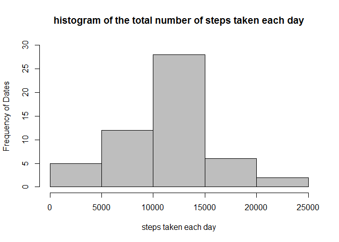
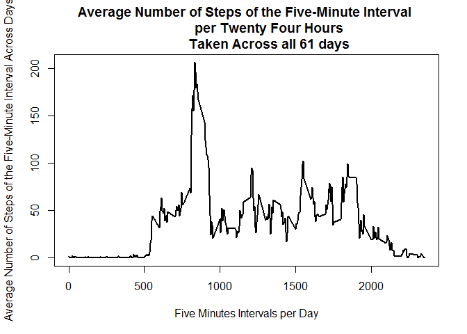
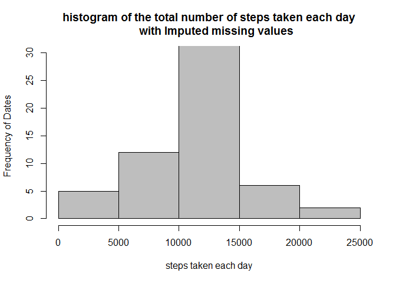
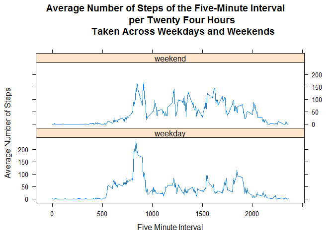

# Reproducible Research: Peer Assessment 1


The purpose of this report is to answer few questions about Personal Movement Using data coming from Activity Monitoring Devices (AMD).  For this purpose, I analyzed a dataset with three variables and a total of 17,568 observations corresponding to one individual's records of steps measured using an AMD.  The time period considered is two months (october and november 2012) and daily intervals of 5 minutes for a total of 24 hours for each day during the period.   The analysis is exploratory, and it uses some tools available from R. 

The questions to be answered in this project are the following:

 1. What is mean total number of steps taken per day? 

 2. What is the average daily activity pattern?

 3. After imputing missing values and reevaluating the answers to Questions 1 and 2   above, do these values differ from the estimates from the first part of the assignment?

 4. Are there differences in activity patterns between weekdays and weekends?

## Loading and preprocessing the data

Intially, before running the code, you should make sure that all needed packages are installed.  In my case, I needed to install dplyr, knitr, sqldf and lattice.  You should use install.packages(" ") and library() to ensure you have the packages needed.  
Once I installed the R packages needed for this project, I ensured the working directory wass correct.  Then,  I generated a directory where the raw data exists separated from the working directory.  To ensure reproducibility, I downloaded the data directly from the source, unzipped it and read it into R.


```
## 
## Attaching package: 'dplyr'
## 
## The following objects are masked from 'package:stats':
## 
##     filter, lag
## 
## The following objects are masked from 'package:base':
## 
##     intersect, setdiff, setequal, union
## 
## Loading required package: gsubfn
## Loading required package: proto
## Loading required package: RSQLite
## Loading required package: DBI
```


```r
#Ensure working directory is correct

#getwd()
```


```r
#Create directory of raw data
if (!dir.exists("./data")) {
  dir.create("./data")
}
#Read file from original source, unzip it and read it into R
fileurl<-("https://d396qusza40orc.cloudfront.net/repdata%2Fdata%2Factivity.zip") 

download.file(fileurl,"./data/activity.zip")

unzip("./data/activity.zip")

act<- read.csv("activity.csv")
```

I used str(), head() and tail() to have a preliminary idea of the structure of the table and if R read it correctly.

```r
str(act)
```

```
## 'data.frame':	17568 obs. of  3 variables:
##  $ steps   : int  NA NA NA NA NA NA NA NA NA NA ...
##  $ date    : Factor w/ 61 levels "2012-10-01","2012-10-02",..: 1 1 1 1 1 1 1 1 1 1 ...
##  $ interval: int  0 5 10 15 20 25 30 35 40 45 ...
```

```r
head(act,3)
```

```
##   steps       date interval
## 1    NA 2012-10-01        0
## 2    NA 2012-10-01        5
## 3    NA 2012-10-01       10
```

```r
tail(act,3)
```

```
##       steps       date interval
## 17566    NA 2012-11-30     2345
## 17567    NA 2012-11-30     2350
## 17568    NA 2012-11-30     2355
```


## What is mean total number of steps taken per day?

  First, I added the steps per date using aggregate().  I also changed the names of the columns to be clearer about their meaning.


```r
#sum Steps
totalstepsdaily <- aggregate(steps ~ date, sum, data = act)

str(totalstepsdaily)
```

```
## 'data.frame':	53 obs. of  2 variables:
##  $ date : Factor w/ 61 levels "2012-10-01","2012-10-02",..: 2 3 4 5 6 7 9 10 11 12 ...
##  $ steps: int  126 11352 12116 13294 15420 11015 12811 9900 10304 17382 ...
```

```r
colnames(totalstepsdaily) <- c("date","totalsteps_day")
names(totalstepsdaily)
```

```
## [1] "date"           "totalsteps_day"
```

Finally I made a histogram of the total number of steps taken each day, and Calculated the mean and median total number of steps taken per day.


```r
hist(totalstepsdaily$totalsteps_day,col = "gray",main = "histogram of the total number of steps taken each day", xlab="steps taken each day", ylab="Frequency of Dates",
      ylim = c(0,30))
```

 


```r
summary(totalstepsdaily$totalsteps_day)
```

```
##    Min. 1st Qu.  Median    Mean 3rd Qu.    Max. 
##      41    8841   10760   10770   13290   21190
```

 

## What is the average daily activity pattern?

To answer this question I  made a time series plot (i.e.  type = "l" ) of the 5-minute interval (x-axis) and the average number of steps taken, averaged across all days (y-axis). For this purpose, I had to generate a subset of the dataset **Act**.  I used aggregate() to generate a new dataset named **averagestepsinterval**, which includes the mean of steps per five-minute interval across the 61 days measured.  Again, this analysis ignored NAs. After I generated the dataset, I changed the column names to be clear about what they represent, and apply str() to make sure the result was what I needed.


```r
averagestepsinterval <- aggregate(steps ~ interval, mean, data = act)
colnames(averagestepsinterval) <- c("interval","averagesteps_interval")
str(averagestepsinterval)
```

```
## 'data.frame':	288 obs. of  2 variables:
##  $ interval             : int  0 5 10 15 20 25 30 35 40 45 ...
##  $ averagesteps_interval: num  1.717 0.3396 0.1321 0.1509 0.0755 ...
```

```r
names(averagestepsinterval)
```

```
## [1] "interval"              "averagesteps_interval"
```

After I generated the new dataset **averagestesinterval**, I plot my data using base plotting system.


```r
plot(averagestepsinterval$interval,averagestepsinterval$averagesteps_interval,type = "l",
     main = "Average Number of Steps of the Five-Minute Interval 
             per Twenty Four Hours
             Taken Across all 61 days", ylab="Average Number of Steps of the Five-Minute Interval Across Days",
     xlab = "Five Minutes Intervals per Day", xlim = c(0,2355) , lwd = 2)
```

 

To answer the question Which 5-minute interval, on average across all the days in the dataset, contains the maximum number of steps, I obtained the maximum average steps per interval across the 61 days, and subsetted the dataset **averagestepsinterval** to obtain the interval with the maximum average number of steps.


```r
maxaveragesteps_interval <-max(averagestepsinterval$averagesteps_interval)

with(averagestepsinterval, subset(interval, averagesteps_interval == max(averagestepsinterval$averagesteps_interval)))
```

```
## [1] 835
```

Interpretation of the interval: the number 835 means the 35 minutes of the hour # 8.  So, the interpretation is that at that hour and minutes the interval shows the maximum average number of steps in the 61 days considered in this analysis. 


## Imputing missing values 

the missing values for steps were coded as  NA in our original dataset act. Because the presence of missing days may introduce bias into some calculations or summaries of the data, we want to reevaluate the answers to questions #1 and #2 above, after imputing the missing values.  
 
###Strategy for Filling in All of the Missing Values in the Dataset

First, to know how many rows have NAs, I used the following code


```r
#How many rows have NAs?
nrow(subset(act,is.na(act$steps=="TRUE")))
```

```
## [1] 2304
```


My strategy is to substitute the NAs with the mean value calculated above for the corresponding interval.  The mean values are part of the table **averagestepsinterval**.  So, I used sqldf() to join the original table **act** with **averagestepsinterval** and to generate a new variable. The new variable is called **stepswithnoNA**. If the value of the variable **steps** is not null, then **stepswithnoNA** = **steps**; if the value of **steps** is null (or NA) then **stepswithnoNA** = **averagestepsinterval**.  


```r
actwithnoNA <-sqldf("select t1.date, t1.interval as intervalONE,t2.interval as intervaltwo,t1.steps,t2.averagesteps_interval,
    case
    when  steps is null  then averagesteps_interval
      when steps is not null  then steps
      end as stepswithnoNA
      from act as t1 inner join averagestepsinterval as t2
      on t1.interval = t2.interval")
```

```
## Loading required package: tcltk
```

```r
str(actwithnoNA)
```

```
## 'data.frame':	17568 obs. of  6 variables:
##  $ date                 : Factor w/ 61 levels "2012-10-01","2012-10-02",..: 1 1 1 1 1 1 1 1 1 1 ...
##  $ intervalONE          : int  0 5 10 15 20 25 30 35 40 45 ...
##  $ intervaltwo          : int  0 5 10 15 20 25 30 35 40 45 ...
##  $ steps                : int  NA NA NA NA NA NA NA NA NA NA ...
##  $ averagesteps_interval: num  1.717 0.3396 0.1321 0.1509 0.0755 ...
##  $ stepswithnoNA        : num  1.717 0.3396 0.1321 0.1509 0.0755 ...
```

```r
head(actwithnoNA,3)
```

```
##         date intervalONE intervaltwo steps averagesteps_interval
## 1 2012-10-01           0           0    NA             1.7169811
## 2 2012-10-01           5           5    NA             0.3396226
## 3 2012-10-01          10          10    NA             0.1320755
##   stepswithnoNA
## 1     1.7169811
## 2     0.3396226
## 3     0.1320755
```

```r
tail(actwithnoNA,3)
```

```
##             date intervalONE intervaltwo steps averagesteps_interval
## 17566 2012-11-30        2345        2345    NA             0.6415094
## 17567 2012-11-30        2350        2350    NA             0.2264151
## 17568 2012-11-30        2355        2355    NA             1.0754717
##       stepswithnoNA
## 17566     0.6415094
## 17567     0.2264151
## 17568     1.0754717
```


The new dataset **actwithnoNA** is equal to the original dataset but with the missing data filled in.

Then, we want to use the new dataset with imputed missing values to Make a histogram of the total number of steps taken each day and to Calculate and report the mean and median total number of steps taken per day.  To make the histogram, again I used aggregate(), and changed the variables' names to make them more explicative.  I used Str(), head() and tail() to make sure the dataset is correct.


```r
totalstepsdailywithnoNA <- aggregate(stepswithnoNA ~ date, sum, data = actwithnoNA )
str(totalstepsdailywithnoNA)
```

```
## 'data.frame':	61 obs. of  2 variables:
##  $ date         : Factor w/ 61 levels "2012-10-01","2012-10-02",..: 1 2 3 4 5 6 7 8 9 10 ...
##  $ stepswithnoNA: num  10766 126 11352 12116 13294 ...
```

```r
colnames(totalstepsdailywithnoNA) <- c("date","sum_stepswithnoNA")
head(totalstepsdailywithnoNA,3)
```

```
##         date sum_stepswithnoNA
## 1 2012-10-01          10766.19
## 2 2012-10-02            126.00
## 3 2012-10-03          11352.00
```

```r
tail(totalstepsdailywithnoNA,3)
```

```
##          date sum_stepswithnoNA
## 59 2012-11-28          10183.00
## 60 2012-11-29           7047.00
## 61 2012-11-30          10766.19
```

The histogram:


```r
hist(totalstepsdailywithnoNA$sum_stepswithnoNA,col = "gray",main = "histogram of the total number of steps taken each day
     with Imputed missing values", xlab="steps taken each day", ylab="Frequency of Dates",
     ylim = c(0,30))
```

 

and the calculations of the median and mean using summary(): 


```r
#Calculate and report the mean and median total number of steps 
         #taken per day. 
#Calculations after imputing missing values
summary(totalstepsdailywithnoNA$sum_stepswithnoNA)
```

```
##    Min. 1st Qu.  Median    Mean 3rd Qu.    Max. 
##      41    9819   10770   10770   12810   21190
```

**Do these values differ from the estimates from the first part of the assignment? What is the impact of imputing missing data on the estimates of the total daily number of steps?

The results of the histogram and the summary functions showed very similar means and medians for the dataset excluding NAs and the dataset including imputed value.


## Are there differences in activity patterns between weekdays and weekends?

For this part, I used the  **weekdays()**  function and the dataset **actwithnoNA** with the filled-in missing values.

 I Created a new categorical variable in the dataset with two levels -- "weekday" and "weekend" indicating whether a given date is a weekday or weekend day.
 For this purpose, I generated a new dataset including the function weekdays.  However, the new dataset had to be forced to be a dataframe because it was read as a list. After I did that, I could apply sqldf to generate the new variable **catweekday**.  the variable **catweekday** is "weekday" when the  
the days of the week are 'Monday','Tuesday','Wednesday','Thursday','Friday' and "weekend" when the days of the week are 'Saturday' or 'Sunday'.


```r
test <- actwithnoNA
test$weekday <- weekdays(as.Date(test$date))
test2 <-as.data.frame(test)
str(test2)
```

```
## 'data.frame':	17568 obs. of  7 variables:
##  $ date                 : Factor w/ 61 levels "2012-10-01","2012-10-02",..: 1 1 1 1 1 1 1 1 1 1 ...
##  $ intervalONE          : int  0 5 10 15 20 25 30 35 40 45 ...
##  $ intervaltwo          : int  0 5 10 15 20 25 30 35 40 45 ...
##  $ steps                : int  NA NA NA NA NA NA NA NA NA NA ...
##  $ averagesteps_interval: num  1.717 0.3396 0.1321 0.1509 0.0755 ...
##  $ stepswithnoNA        : num  1.717 0.3396 0.1321 0.1509 0.0755 ...
##  $ weekday              : chr  "Monday" "Monday" "Monday" "Monday" ...
```

```r
head(test2,3)
```

```
##         date intervalONE intervaltwo steps averagesteps_interval
## 1 2012-10-01           0           0    NA             1.7169811
## 2 2012-10-01           5           5    NA             0.3396226
## 3 2012-10-01          10          10    NA             0.1320755
##   stepswithnoNA weekday
## 1     1.7169811  Monday
## 2     0.3396226  Monday
## 3     0.1320755  Monday
```

```r
tail(test2,3)
```

```
##             date intervalONE intervaltwo steps averagesteps_interval
## 17566 2012-11-30        2345        2345    NA             0.6415094
## 17567 2012-11-30        2350        2350    NA             0.2264151
## 17568 2012-11-30        2355        2355    NA             1.0754717
##       stepswithnoNA weekday
## 17566     0.6415094  Friday
## 17567     0.2264151  Friday
## 17568     1.0754717  Friday
```

```r
act2 <-sqldf("select intervalONE as interval,stepswithnoNA,
       case 
       when weekday in ('Monday','Tuesday','Wednesday','Thursday','Friday')
            then 'weekday'
       
       when weekday in ('Saturday','Sunday')
            then 'weekend'
       end as catweekday
       from test2")
```

After I created the new variable **catweeday**, I obtained the total number of steps per interval and per category of day (weekday or weekend)


```r
act3 <-sqldf("select catweekday,interval,sum(stepswithnoNA) as totalsteps
             from act2
             group by catweekday,interval")    


act4 <-sqldf("select catweekday,interval,avg(stepswithnoNA) as Avgsteps
             from act2
         
             group by catweekday,interval
             ")

str(act4)
```

```
## 'data.frame':	576 obs. of  3 variables:
##  $ catweekday: chr  "weekday" "weekday" "weekday" "weekday" ...
##  $ interval  : int  0 5 10 15 20 25 30 35 40 45 ...
##  $ Avgsteps  : num  2.251 0.445 0.173 0.198 0.099 ...
```

Then I made a panel plot using lattice() containing a time series plot (i.e.  type = "l" ) of the 5-minute interval (x-axis) and the average number of steps taken averaged across all weekday days or weekend days (y-axis). 
  

```r
xyplot(Avgsteps~interval|catweekday, data = act4, layout = c(1,2), type = "l",
       xlab = "Five Minute Interval",
       ylab = "Average Number of Steps",
       main = "Average Number of Steps of the Five-Minute Interval 
             per Twenty Four Hours 
             Taken Across Weekdays and Weekends"
)
```

 


